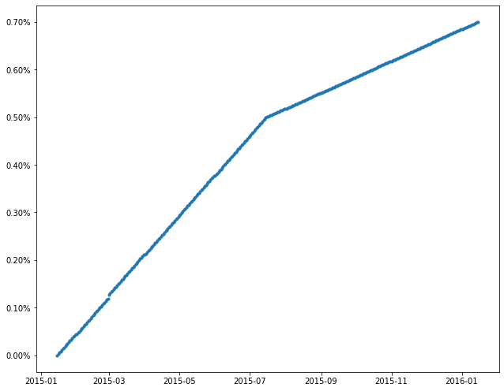
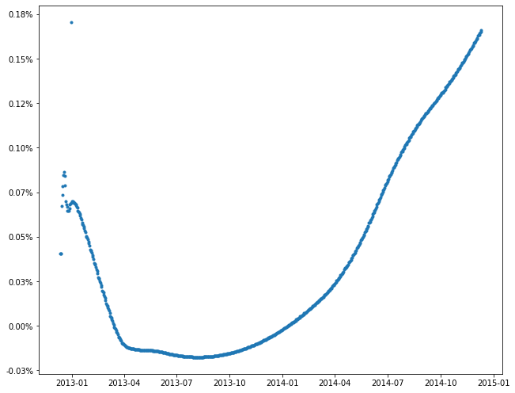

# QuantLib Extension

## Introduction

QuantLib is a well known free and open source quantitative library for finance. It has interfaces in Python, Java, R, etc. which was generated with SWIG. It is gradually accepted by financial engineering and researcher over the world. But because of the lacking of documentation, the adoption process is slow. There are two books "Implementing Quantlib -- An Inside Look at Quantitative Finance in C++" written by Luigi Ballabio and "Quantlib Python Cookbook -- Hands-on Quantitative Finance in Python" by Goutham Balaraman and Luigi Ballabio. But it seems, these books are not easy for most of the readers. The objective of this project is provide an easy extension to QuantLib Python by absorbing my long time experiences in the industry.

All my extensions will **be compatible** with the existing interfaces.

Here's the critical ones:

- Make QuantLib Python functions/methods accept both Object and symbol, for example, many Quantitative Library in wall street companies allow developers use symbol, such as "Act/Act" to represent Actual Actual day counting basis while QuantLib only allows objects of class AcutalActual. This is not convenient in practice when building pricing and risk applications.

- Make QuantLib Python functions/methods accept dates in YYYYMMDD format. This will not only make code cleaner but also save developers and researchers a lot of time in constructing Date objects.

- Create a centralized calendar manager, which allows you load calendar from centralized repository by protocols such as http/https/file, or database access. Strategy pattern will be used. URL based loader (supports protocols such as http, https, file), and loaders for SQLite and MySql will be provided. Users can create their owner loaders for other database, e.g. Oracle, MongoDB, etc. very easily.

- Create a centralized schedule manager, which allows you load bond/swap schedules from centralized repository by http/https, file system, or database. Strategy pattern will be used.

- Extend all critical classes to make them accept both symbols and objects. Decorator pattern will be used.

- Design a generic curve builder based on QuantLib Python.

I'm going to explain the idea behind it be giving an example which was written in original QuantLib python, and show you how it looks like when the extension is used. Then, I'm going to introduce the symbol matching extension, calendar manager, schedule manager, curve builder, etc. respectively.

## An Example

The following example was from http://gouthamanbalaraman.com/blog/quantlib-bond-modeling.html.
There's no technical or calculation problem in this example, but we can make it simpler.


```python
import QuantLib as ql

todaysDate = ql.Date(15, 1, 2015)
ql.Settings.instance().evaluationDate = todaysDate
spotDates = [ql.Date(15, 1, 2015), ql.Date(15, 7, 2015), ql.Date(15, 1, 2016)]
spotRates = [0.0, 0.005, 0.007]
dayCount = ql.Thirty360()
calendar = ql.UnitedStates()
interpolation = ql.Linear()
compounding = ql.Compounded
compoundingFrequency = ql.Annual
spotCurve = ql.ZeroCurve(spotDates, spotRates, dayCount, calendar, interpolation,
                         compounding, compoundingFrequency)
spotCurveHandle = ql.YieldTermStructureHandle(spotCurve)

issueDate = ql.Date(15, 1, 2015)
maturityDate = ql.Date(15, 1, 2016)
tenor = ql.Period(ql.Semiannual)
calendar = ql.UnitedStates()
bussinessConvention = ql.Unadjusted
dateGeneration = ql.DateGeneration.Backward
monthEnd = False
schedule = ql.Schedule(issueDate, maturityDate, tenor, calendar, bussinessConvention,
                       bussinessConvention, dateGeneration, monthEnd)
# list(schedule)
print('--- schedule ---')
for dt in schedule:
    print(dt)
print('--- schedule ---')

# Now lets build the coupon
dayCount = ql.Thirty360()
couponRate = .06
coupons = [couponRate]

# Now lets construct the FixedRateBond
settlementDays = 0
faceValue = 100
fixedRateBond = ql.FixedRateBond(
    settlementDays, faceValue, schedule, coupons, dayCount)

# create a bond engine with the term structure as input;
# set the bond to use this bond engine
bondEngine = ql.DiscountingBondEngine(spotCurveHandle)
fixedRateBond.setPricingEngine(bondEngine)

# Finally the price
npv = fixedRateBond.NPV()

print(npv)

```

    --- schedule ---
    January 15th, 2015
    July 15th, 2015
    January 15th, 2016
    --- schedule ---
    105.27653992490683
    

From the above example, the following should be done when we calculate NPV for a fixed rate bond:

- create simple objects for calendar, day count convention, interpolation method, etc.

- build a curve

- generate schedule for the bond

- create a bond

- create a pricing engine

Many companies opt to build curves and store in a centralized repository to be shared by all applications and all researchers.

Similarly, many companies opt to store schedules in databases to avoid code changes when schedules need to be modified.

On the other hand, developers and researchers prefer passing symbols for day count conventions, rolling conventions, etc. Many applications are data driven, when we need to have a way to translate symbols to objects anyway. It will be convenient if the library understand both symbols and corresponding objects.

Most of the researchers and developers prefer the following form of code:


```python
import ext.QuantLibClassExt as qlx
import ext.SimpleCurveManager as mgr

todaysDate = 20150115
dayCount = '30/360'
schedule = 'BD20160115'
coupons = [.06]
settlementDays = 0
faceValue = 100.0

# setEvalDate(todaysDate)
spotCurve = mgr.ZeroCurve(todaysDate, 'ZC001')

fixedRateBond = qlx.FixedRateBond(
    settlementDays, faceValue, schedule, coupons, dayCount,
    curve=spotCurve, engine='DiscountingBond')

npv = fixedRateBond.NPV()

print(npv)

```

    105.27653992490683
    

**How was the above achived?**

This was based on the extension for QuantLib Python, which will be discussed in the following sections. The simple curve data was put in a json file named **ZC001*.json*, the schedule was put in a file named **BD20160115.json**. These can also be put in database. It might be clearer to put them in JSON files for illustration purposes, because people will have less settings, no dependencies on any databases.

## Directory Tree of QuantLib Python Extension

By default this project organize files as following. Many sub-directories are optional, for example if you download calendars and schedules from web services or fetch them from database you don't need **calendars** and **schedules**.
```
├───calendars
├───config
├───curves
│   └───input <curve marks>
├───db
├───docs
│   └─── <documents>
├───examples
├───ext
│   └─── <python code>
└───schedules
    └─── <schedule files>
```

- If schedules are put in database or web service you don't need "schedules" sub-directory

- If calendars are put in database or web service you don't need "calendars" sub-directory

- db sub-directory is only needed if you decide to use Sqlite 3 to store calendars, schedules, curve input, etc.

For simplicity we suppose to use file system in the following sections.


## Class and Enum Mapping

In reality, developers and reaschers deal with symbols, for example when dealing with day count basis we usually "Act/Act", "Act/360", "30/360", when dealing with calendars we use "TGT" for TARGET, "NYX" for New York Stock Exchange, etc. Programs are usually data driven, almost no one hard coded business conventions.

Since different company may use different symbols and to make symbol lookup case insensative, I've defined symbol-object map as JSON file **QuantLibConfig.json** under **config** directory. Definitely, this can be saved in Databases.

You can modify the configurations according to your needs as long as the keys are not duplicated. For example, business day rolling conventions are pref-defined as following:

```
"ROLL_CONV_MAP" : {
	   "FOLLOWING"        : "Following",
	   "MODIFIEDFOLLOWING": "ModifiedFollowing",
	   "PRECEDING"        : "Preceding",
	   "MODIFIEDPRECEDING": "ModifiedPreceding",
	   "UNADJUSTED"       : "Unadjusted",
	   "HALFMONTHMODIFIEDFOLLOWING": "HalfMonthModifiedFollowing",
	   "F"   : "Following",
	   "MF"  : "ModifiedFollowing",
	   "P"   : "Preceding",
	   "MP"  : "ModifiedPreceding",
	   "U"   : "Unadjusted",
	   "HMMF": "HalfMonthModifiedFollowing"
	},
```

All key words are in capital letters. Multiple keys can map to the same class, in the above example "FOLLOWING" and "F" both mean "Following" rolling convention class. The mappers will do case-insensitative lookup by converting given key works to upper case first.

TODO: Add more tetails here.

## Class Extentions

It would be conevient if those functions/methods which accept objects of specific classes can also accept symbols, e.g. "Act/Act", dates in YYYYMMDD format

### Design Patterns - Decorator & Composite

The decorator pattern describes a way to add or remove behaviour to/from a function dynamically. When we decorate a class, we need to use it with Composite pattern. The callables used for the function composition should be hold independently by a Composer object.

The following is quoted from https://python-patterns.guide/gang-of-four/decorator-pattern/#implement-dynamic-wrapper
> A very common approach to the Decorator Pattern in Python is the **dynamic wrapper**. Instead of trying to implement a method and property for every method and attribute on the wrapped object, a dynamic wrapper intercepts live attribute accesses as the program executes and responds by trying to access the same attribute on the wrapped object.

> A dynamic wrapper implements the dunder methods getattr(), setattr(), and — if it really wants to be feature-complete — delattr() and responds to each of them by performing the equivalent operation on the wrapped object. Because getattr() is only invoked for attributes that are in fact missing on the wrapper, the wrapper is free to offer real implementations of any methods or properties it wants to intercept.

> There are a few edge cases that prevent every attribute access from being handled with getattr(). For example, if the wrapped object is iterable, then the basic operation iter() will fail on the wrapper if the wrapper is not given a real iter() method of its own. Similarly, even if the wrapped object is an iterator, next() will fail unless the wrapper offers a real next(), because these two operations examine an object’s class for dunder methods instead of hitting the object directly with a getattr().

> As a result of these special cases, a getattr-powered wrapper usually involves at least a half-dozen methods in addition to the methods you specifically want to specialize.

A sample decorator is as below:

```
class DynamicDecorator(object):
    def __init__(self, to_be_decorated):
        self._to_be_decorated = to_be_decorated


    def func01(self, *args, **kargs):
        # do you decoration here
        self._to_be_decorated.func01(*args, **kargs)


    def func02(self, *args, **kargs):
        # do you decoration here
        self._to_be_decorated.func02(*args, **kargs)

    ...

    def __iter__(self):
        return self.__dict__['_to_be_decorated'].__iter__()

    def __next__(self):
        return self.__dict__['_to_be_decorated'].__next__()

    def __getattr__(self, name):
        return getattr(self.__dict__['_to_be_decorated'], name)

    def __setattr__(self, name, value):
        # you can setattr for this or fo the following
        setattr(self..__dict__['_to_be_decorated'], name, value)

    def __delattr__(self, name):
        delattr(self.__dict__['_to_be_decorated'], name)
        
```

### Term Strcture Decorator

TBD

### Curve Engine Decorator

TBD

### Bond Decorator

TBD

### Swap Decorator

TBD

...


```python

```


```python

```

## Calendar Manager

The Calendar Manager makes users can choose to use their own calendars or to use the QuantLib built-in calendar classes.
QuantLib uses classes/functions to generate calendars by rules. This makes applications less flexible, for example, sometimes holidays might be changed. Modifying code may introduce bugs. On the other hand, most of the developers and researchers who use QuantLib may not have the ability to modify and rebuild QuantLib and QuantLib SWIG wrappers. It is necessay to design a calendar manager which on one hand is compatible with all the QuantLib functions, on the other hand allows users use their calendars stored in either file system, various database, or web services.

Another consideration is that different company may use different calendar symbol/ID, we must provide a way to let user define their own symbols/IDs and map their own symbols/IDs to their own source of calendars.

The Calendar Manager defines an **"index"** named **Calendar.idx** under *config" folder, where you can define your own calendar code and specify the source of their calendars. For example, if you use file system you can do the following:

```
CODE, Name                           , URL
----------------------------------------------
FED , UnitedStates.FederalReserve    , FED.cal
GOV , UnitedStates.GovernmentBond    , GOV.cal
LOR , UnitedStates.LiborImpact       , LOR.cal
NER , UnitedStates.NERC              , NER.cal
NYX , UnitedStates.NYSE              , NYX.cal
USD , UnitedStates.Settlement        , USC.cal
LDX , UnitedKingdom.Exchange         , LDX.cal
MTL , UnitedKingdom.Metals           , MTL.cal
UKC , UnitedKingdom.Settlement       , UKC.cal
BRC , Brazil.Settlement              , BRC.cal
BRX , Brazil.Exchange                , BRX.cal
CAC , Canada.Settlement              , CAC.cal
TSX , Canada.TSX                     , TSX.cal
IBC , China.IB                       , IBC.cal
SSE , China.SSE                      , SSE.cal
PSE , CzechRepublic.PSE              , PSE.cal
EUX , Germany.Eurex                  , EUX.cal
FSX , Germany.FrankfurtStockExchange , FSX.cal
DEC , Germany.Settlement             , DEC.cal
XTA , Germany.Xetra                  , XTA.cal
BEJ , Indonesia.BEJ                  , BEJ.cal
JSX , Indonesia.JSX                  , JSX.cal
ILC , Israel.Settlement              , ILC.cal
TAX , Israel.TASE                    , TAX.cal
ITX , Italy.Exchange                 , ITX.cal
ITC , Italy.Settlement               , ITC.cal
MOX , Russia.MOEX                    , MOX.cal
RUC , Russia.Settlement              , RUC.cal
KRX , SouthKorea.KRX                 , KRX.cal
KRC , SouthKorea.Settlement          , KRC.cal
HKX , HongKong.HKEx                  , HKX.cal
ICX , Iceland.ICEX                   , ICX.cal
NSE , India.NSE                      , NSE.cal
BMV , Mexico.BMV                     , BMV.cal
TDL , SaudiArabia.Tadawul            , TDL.cal
SGX , Singapore.SGX                  , SGX.cal
SKX , Slovakia.BSSE                  , SKX.cal
TSE , Taiwan.TSEC                    , TSE.cal
UAX , Ukraine.USE                    , UAX.cal
ARC , Argentina                      , ARC.cal
AUC , Australia                      , AUC.cal
BWC , Botswana                       , BWC.cal
DKC , Denmark                        , DKC.cal
FIC , Finland                        , FIC.cal
HUC , Hungary                        , HUC.cal
JPC , Japan                          , JPC.cal
NZC , NewZealand                     , NZC.cal
NOC , Norway                         , NOC.cal
PLC , Poland                         , PLC.cal
ROC , Romania                        , ROC.cal
ZAC , SouthAfrica                    , ZAC.cal
SEC , Sweden                         , SEC.cal
CHC , Switzerland                    , CHC.cal
THC , Thailand                       , THC.cal
TRC , Turkey                         , TRC.cal
TGT , TARGET                         , TGT.cal
FRX , None                           , FRX.cal
FRC , None                           , FRX.cal
WEO , WeekendsOnly                   ,

```

The URL can be something like **http://intranet.youcorp.com/cal?USD** or **"file:////C:/QuantLibExt/calendars/USD.cal"**. If you put it as simple as "USD.cal" then our CalendarManager will try to find it from the **calendar** sub-directory of the pre-defined directory tree described in previous sections.

### Design Patterns

#### Singleton Pattern

Calendars and schedule are static, it is unnecessary to create objects every time when we use them. Initializing objects is costly, it not only takes time but also consumes memory. Singleton is a way to provide one and only one object of a particular type. To accomplish this, you must take control of object creation out of the hands of the programmer. One convenient way to do this is to delegate to a single instance of a private nested inner class. Because Python provices method **getattr** and also allows developers implement their own **getattr** method be overriding **__getattr__**, this makes singleton implementation in python is a little than doing it in Java and C++.

A typical Singleton in Python looks like:
```
class SimpleSingleton:
    class __SimpleSingleton:
        def __init__(self, *args, **kargs):
            # do initialization here
            
        def method1(self, *args, **kargs):
            # define method1

        def method2(self, *args, **kargs):
            # define method2

    # declare class variable
    instance = None

    def __init__(self, *args, **kargs):
        if not SimpleSingleton.instance:
            SimpleSingleton.instance = SimpleSingleton.__SimpleSingleton(*args, **kargs)

    # deligate the attribute lookup method to the inner class
    def __getattr__(self, name):
        return getattr(self.instance, name)
```

#### Strategy Pattern

An important consideration for the Calendar Manager is to allow users design their own data loaders. An URL based loader for loading data from web service and file system, and one for loading data from SQLite have been provided. Users can simply model these to implement their own loaders for Oracle, MS SQL Server, MySQL, MongoDB, etc.

Strategy Pattern serves this algorithm or procedure substitution purposes.


#### Calendar Format

Calendars define holidays, if you'd like to store calendars in files, then each calendar will have its own file with the calendar ID as its file names, e.g. "USD.cal"

```
...
20180101
20180115
20180219
20180528
20180704
20180903
20181008
20181112
20181122
20181225
20190101
20190121
20190218
20190527
20190704
20190902
20191014
20191111
20191128
20191225
20200101
20200120
20200217
20200525
20200703
20200907
20201012
20201111
20201126
20201225
20210101
20210118
20210215
20210531
20210705
20210906
20211011
...
```

Calendar Manager is widely used in the extentions to the existing classes and static functions.


```python

```

## Schedule Manager


In practice, financial companies opt to maintain schedule of bonds, swaps, etc. in centralized repositories. This is because:

- program generated schedule are not always correct. Although QuantLib provides very powerful and flexible functions for schedule generation, not all developers can make it good.

- try to avoid modifying programs if schedules are changed.

- centralized schedules can be shared by multiple applications, it is easy to make the schedules consistent among all applications.

### Design Patterns

Schedule Manager uses **singleton** and **strategy** patterns as we did in Calendar Manager.

### The Repository

Schedules can be fetched from file system, or web services. This can be configured in your application by specifying URL pattern in configuration file ScheduleConfig.json

``` 
{
	"URL":"C:\\QuantLibExt\\schedules\\{0}.json"
}
```

The above configuration will be ignored if databases are used.


### Schedule File Format

Example

``` Python
{
    "calendar": "NYX",
    "dates": [
        20150102,
        20150202,
        20150302,
        20150401,
        20150501,
        20150601,
        20150701,
        20150803,
        20150901,
        20151001,
        20151102,
        20151201,
        20160104
    ],
    "rolling": "F"
}
```


TODO: add more details here


```python

```

## Curve Builder

Building curve is not a simple task. Curves should be built and saved in centralized repositories. All the applications should share the same curves instead of building them and using them separately.

Market data should be collected and saved in centralized repositories too.

The QuantLib Extension desinged two modules for curve building, one for simple curves, another for curves with multiple intruments.

### Simple Curve Builder

We've used the SimpleCurveManager in the **Introduction** section. The following is a sample curve mark:

```
{
	"basis": "30/360",
	"calendar": "USD",
	"interpolation": "Linear",
	"compounding": "Compounded",
	"frequency": "Annual",
	"marks": [
		[20150115, 0.0  ], 
		[20150715, 0.005], 
		[20160115, 0.007]]

}
```

Creating a simple curve is as simple as below:

```
curve = mgr.ZeroCurve(20150115, 'ZC001')
```

To facilitate the demostration, let's define a curve plotting function.


```python
import matplotlib.pyplot as plt
import datetime
from matplotlib.ticker import FuncFormatter
import ext.QuantLibClassExt as qlx
import ext.SimpleCurveManager as mgr

def plotCurve(lineType, dates, rates):
    pydt = [datetime.datetime(d.year(), d.month(), d.dayOfMonth())
            for d in dates]
    fig, ax = plt.subplots()
    fig.set_size_inches(10.5, 9.5)
    ax.yaxis.set_major_formatter(
        FuncFormatter(lambda r, pos: '{:.2%}'.format(r)))
    plt.subplots_adjust(bottom=0.2)
    l, = plt.plot(pydt, rates, lineType)
#     plt.show()
```

**now build the curve**


```python
# build the curve 
curve = mgr.ZeroCurve(20150115, 'ZC001')
```

**check the curve**


```python
# check the curve
print(curve.referenceDate())
print(curve.dayCounter())
today = curve.referenceDate()
end = today + ql.Period(1, ql.Years)
dates = [ql.Date(serial)
         for serial
         in range(today.serialNumber(), end.serialNumber() + 1)]    
rates = [curve.zeroRate(dt, curve.dayCounter(), 'Simple').rate() for dt in dates]
plotCurve('.', dates, rates)
```

    January 15th, 2015
    30/360 (Bond Basis) day counter
    





###  Builder for Curve with Multiple Instruments

The following article presents an example of building EONIA curve with multiple instruments and year end turns.
https://leanpub.com/quantlibpythoncookbook/read

The curve is described as below:

```
{
	"Deposits": [
	   {
	      "calendar": "TGT",
	      "tenor": "1d",
	      "rolling": "F",
	      "basis": "Act/360",
	      "month_end": false,
	      "marks": [
	          [0, 0.0004], 
	          [1, 0.0004], 
	          [2, 0.0004] 
	      ]
	   }
	],
	"OISs": [
		{
		    "index":"Eonia",
		    "settlementDays":2,
		    "marks":[
		            ["1W", 0.00070],
		            ["2W", 0.00069],
		            ["3W", 0.00078],
		            ["1M", 0.00074]
		        ]
		},
		{
		    "index":"Eonia",
		    "marks":[
						[20130116, 20130213, 0.000460 ],
						[20130213, 20130313, 0.000160 ],
						[20130313, 20130410, -0.000070],
						[20130410, 20130508, -0.000130],
						[20130508, 20130612, -0.000140]
		        ]
		},
		{
		    "index":"Eonia",
		    "settlementDays":2,
		    "marks":[
						["15M", 0.000020],
						["18M", 0.000080],
						["21M", 0.000210],
						["2Y" , 0.000360],
						["3Y" , 0.001270],
						["4Y" , 0.002740],
						["5Y" , 0.004560],
						["6Y" , 0.006470],
						["7Y" , 0.008270],
						["8Y" , 0.009960],
						["9Y" , 0.011470],
						["10Y", 0.012800],
						["11Y", 0.014040],
						["12Y", 0.015160],
						["15Y", 0.017640],
						["20Y", 0.019390],
						["25Y", 0.020030],
						["30Y", 0.020380]
		        ]
		}		
	],
	"Turns": {
		"days":[20121231],
		"values":[0.999994473276139]
	}
}

```


```python
import ext.Config as config
import ext.CurveBuilder as builder

asOfDate = 20121211
basis = 'Act/365F'
instFileUrl = config.getCurveInputFile('eonia_bootstrap.json')

curve = builder.buildCurveWithJson(
    'PiecewiseLogCubicDiscount',
    asOfDate, basis, instFileUrl)

data = curve.oneDayForwardRates('2Y', 'TGT', compounding='Simple')


plotCurve('.', **data)
```





## TODO

Add more details when I'm free.
